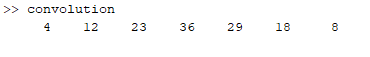
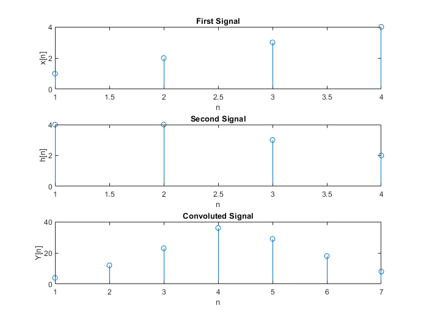

### **Experiment No:** 01
### **Experiment Name:** Convolution of Two Signals  

### **Theory:**

<p align='justify'>
Convolution is a mathematical way of combining two signals to form a third signal. It is an important technique in Digital Signal Processing. Convolution is a formal mathematical operation, just as multiplication, addition, and integration. Addition takes two numbers and produces a third number, while convolution takes two signals and produces a third signal.
</p>
<p align='justify'>

The convolution of two signals $x(n)$ and $h(n)$ is given by,

$$

y\left( n\right) =x\left( n\right) \cdot h\left( n\right) =\sum ^{\infty }_{k=-\infty }x\left( k\right) \cdot h\left( n-k\right)

$$

Or,

$$

y\left( n\right) =h\left( n\right) \cdot x\left( n\right) =\sum ^{\infty }_{k=-\infty }h\left( k\right) \cdot x\left( n-k\right)

$$

</p>

<br>


### **Code:**

```matlab
x = [1, 2, 3, 4];
h = [4, 4, 3, 2];
L = length(x);
M = length(h);
N = L + M - 1;
cv = zeros(1,N);
x1 = [x, zeros(1,L)];
h1 = [h, zeros(1,M)];
for i = 1:N
    for j = 1:M
    if (i-j+1) > 0
        cv(i) = cv(i) + x1(j)*h1(i-j+1);
    end
    end
end
disp(cv)
subplot(3,1,1); stem(x); xlabel('n');
ylabel('x[n]'); title('First Signal');
subplot(3,1,2); stem(h); xlabel('n');
ylabel('h[n]'); title('Second Signal');
subplot(3,1,3); stem(cv); xlabel('n');
ylabel('Y[n]'); title('Convoluted Signal');

```

### **Output:**




<br>

### **Discussion and Conclusion:**
<p align='justify'>
In this experiment, convolution was implemented without using any built-in function and the result 
was plotted.
</p>