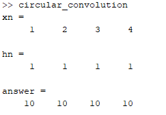

### **Experiment No:** 02(a)
### **Experiment Name:** Implementation of Circular Convolution 

### **2(a) Theory:**

<p align='justify'>

Convolution is a mathematical way of combining two signals to form a third signal. It is an important technique in Digital Signal Processing. Convolution is a formal mathematical operation, just as multiplication, addition, and integration. Addition takes two numbers and produces a third number, while convolution takes two signals and produces a third signal.
</p>
<p align='justify'>

Circular convolution, also known as cyclic convolution, is a special case of periodic convolution, which is the convolution of two periodic functions that have the same period.
</p>
<p align='justify'>

Generally, there are two methods, which are adopted to perform circular convolution and they are:
<ol type='i'>

<li> Concentric circle method
<li> Matrix multiplication method
</ol>
</p>
<br>

### **2(a) Code:**

```matlab
xn = [1 2 3 4];
hn = [1 1 1 1];
n1 = length(xn);
n2 = length(hn);
n = max(n1,n2);
if(n1>n2)
hn = [hn, zeros(1,n-n2)];
else
xn = [xn, zeros(1,n-n1)];
end
y = zeros(1,n);
for i=0:n-1
for j=0:n-1
z = mod(i-j,n);
y(i+1) = y(i+1)+xn(j+1).*hn(z+1);
end
end
display('xn = ');
disp(xn)
display('hn = ');
disp(hn)
display('answer = ');
disp(y)
subplot(3,1,1); stem(xn); xlabel('n');
ylabel('x[n]'); title('First Signal');
subplot(3,1,2); stem(hn); xlabel('n');
ylabel('h[n]'); title('Second Signal');
subplot(3,1,3); stem(y); xlabel('n');
ylabel('Y[n]'); title('Convoluted Signal');

```

### **2(a) Output:**



<br>

### **Experiment No:** 02(b)
### **Experiment Name:** Addition & Subtraction of two signals 
<br>

### **2(b) Code:**

```matlab
sig1= [0 0 0 0 0 0 1 1 1 1 1 1 0 0 0 0 0 0 0];
sig2= [0 0 0 0 0 0 0 0 0 1 1 1 1 1 1 0 0 0 0];
t = 1:19;
subplot(4,1,1);
stem(t,sig1);
xlabel('n');
ylabel('X(n)');
title('Signal 1');
subplot(4,1,2);
stem(t,sig2);
xlabel('n');
ylabel('X(n)');
title('Signal 2');
sig3 = sig1+sig2;
subplot(4,1,3);
stem(t,sig3);
xlabel('n');
ylabel('X(n)');
title('Addition');
sig4 = sig1-sig2;
subplot(4,1,4);
stem(t,sig4);
xlabel('n');
ylabel('X(n)');
title('Subtraction');

```

### **2(b) Output:**

<br>

### **Experiment No:** 02(c)
### **Experiment Name:** Representation of Given Signals 
<br>

### **2(c) Code:**

```matlab
t = 0:4;
t1 = 0:7;
u1 = [0 1 1 1 0];
u2 = [0 1 1 2 2 1 1 0];
subplot(2,1,1)
plot(t,u1);
ylim([0,2]);
subplot(2,1,2)
plot(t1,u2);
ylim([0,3]);

```

### **2(c) Output:**

<br>
<br>

### **Discussion and Conclusion:**
<p align='justify'>
In this experiment we have implemented circular convolution without using built-in function.
</p>
<p align='justify'>
We have plotted two signals and also displayed their addition and subtraction.
</p>
<p align='justify'>
Lastly, we have represented two given signals in a single figure.
</p>