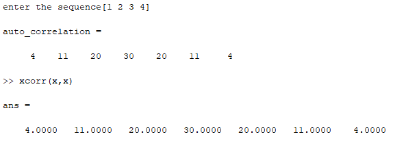
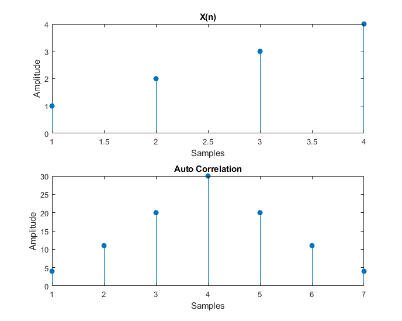
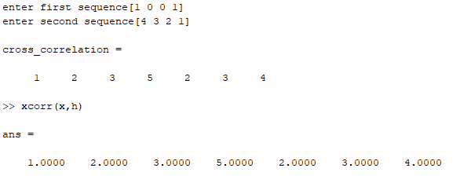
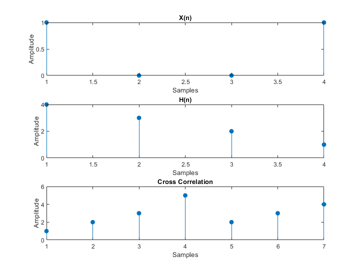

### **Experiment No:** 03(a)
### **Experiment Name:** Implementation of Auto Correlation 

### **3(a) Theory:**

<p align='justify'>

Correlation is a mathematical operation that is very similar to convolution. Correlation is an operation used in many applications in digital signal processing. It is a measure of the degree to which two sequences are similar.
</p>
<p align='justify'>

Depending on whether the signals considered for correlation are same or different, we have two kinds of correlation:
<ol type='i'>

<li> Auto Correlation
<li> Cross Correlation
</ol>
</p>
<p align='justify'>

Auto-Correlation:
This is a type of correlation in which the given signal is correlated with itself, usually the time-shifted version of itself.
The autocorrelation of the discrete time signal $𝑥(𝑛)$ is expressed as,

$$
r_{xx}=\sum ^{\infty }_{n=-\infty }x\left( n\right) \cdot x\left( n-m\right)
$$

</p>

<br>

### **3(a) Code:**

```matlab
clc; clear all; close all;
x=input('enter the sequence');
h = fliplr(x);
z = [];
for i=1:length(x)
    g = h.*x(i);
    z = [z g]; 
end

%disp(z);
z1=reshape(z,length(x),length(x),[]);
z2=z1';
%disp(z2);
z3 = flip(z2);
%disp(z3);
cd = 0;
y = [];
for i=length(x)-1:-1:-(length(x)-1)
    cd=sum(diag(z3,i));
    y=[y cd];
    cd = 0;
end
%disp(y);
auto_correlation = flip(y);
auto_correlation

subplot(2,1,1)
stem(x,'filled')
ylabel('Amplitude')
xlabel('Samples')
title('X(n)')

subplot(2,1,2)
stem(auto_correlation,'filled')
ylabel('Amplitude')
xlabel('Samples')
title('Auto Correlation')

```

### **3(a) Output:**



<br>

### **Experiment No:** 03(b)
### **Experiment Name:** Implementation of Cross Correlation
<br>

### **3(b) Theory:**

<p align='justify'>

Cross-Correlation:
This is a kind of correlation, in which the signal in-hand is correlated with another signal so as to  know how much resemblance exists between them.
</p>
<p align='justify'>

The Cross-Correlation of the discrete time signals $𝑥(𝑛)$ and $𝑦(𝑛)$ is expressed as,

$$
r_{xy}=\sum ^{\infty }_{n=-\infty }x\left( n\right) \cdot y\left( n-m\right)
$$
</p>
<br>

### **3(b) Code:**

```matlab
clc;clear all;close all;
x= input('enter first sequence');
h = input('enter second sequence');
h1=fliplr(h);
z = [];
for i=1:length(x)
    g = h1.*x(i);
    z = [z g]; 
end
z1=reshape(z,length(x),length(x),[]);
z2=z1';
z3 = flip(z2);
cd = 0;
y = [];
for i=length(x)-1:-1:-(length(x)-1)
    cd=sum(diag(z3,i));
    y=[y cd];
    cd = 0;
end
cross_correlation = flip(y);
cross_correlation
subplot(3,1,1)
stem(x,'filled')
ylabel('Amplitude')
xlabel('Samples')
title('X(n)')
subplot(3,1,2)
stem(h,'filled')
ylabel('Amplitude')
xlabel('Samples')
title('H(n)')
subplot(3,1,3)
stem(cross_correlation,'filled')
ylabel('Amplitude')
xlabel('Samples')
title('Cross Correlation')

```

### **3(b) Output:**



<br>

### **Discussion and Conclusion:**
<p align='justify'>

In this experiment we were familiarized with auto-correlation and cross-correlation. We implemented both of these operation in MATLAB and verified the produced result by comparing with built in function output.
</p>