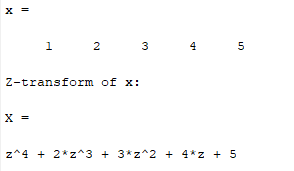
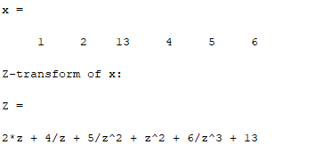

### **Experiment No:** 05(a)
### **Experiment Name:** Z-transform of Causal Signal 


### **Theory:**

<p align='justify'>
Z-transform is a mathematical tool that converts discrete time system into algebric equation in z-plane/domain. Z domain is complex frequency domain. If x(n) is a discrete time signal, then Z-transform is given by,

$$
Z\left[ x(n)\right] =X\left( Z\right)  =\sum ^{\infty }_{n=-\infty }x\left( n\right) z^{-n}
$$

</p>
<p align='justify'>
A  signal is said to be causal if its amplitude is zero for negative time, i.e. x(n) = 0 for n < 0.
</p>
<br>

### **5(a) Code:**

```matlab
x = [1 2 3 4 5];
l = length(x);
X = 0;
z = sym('z');
for i = 0:l-1
    X = X + x(i+1)*z^(-i);
end
display(x)
disp('Z-transform of x:')
display(X)

```

### **5(a) Output:**

<br>
<br>

### **Experiment No:** 05(b)
### **Experiment Name:** Z-transform of anti-Causal Signal 
<br>

### **Theory:**
<p align='justify'>
A  signal is said to be anti-causal if its amplitude is zero for positive time, i.e. x(n) = 0 for n > 0.
</p>
<br>
### **5(b) Code:**

```matlab
x = [1 2 3 4 5];
l = length(x);
X = 0;
z = sym('z');
for i = l-1:-1:0
    X = X + x(i+1)*z^(abs(i-(l-1)));
end
display(x)
disp('Z-transform of x:')
display(X)

```

### **5(b) Output:**

<br>
<br>

### **Experiment No:** 05(c)
### **Experiment Name:** Z-transform of non-Causal Signal
<br>

### **Theory:**
<p align='justify'>
A signal which is neither causal nor anticausal is called a non-causal signal.
</p>
<br>

### **5(c) Code:**

```matlab
x = [1 2 13 4 5 6];
z_val = 3; %index 3 = value 13
l = length(x);
Z = 0;
z = sym('z');
for i = z_val:-1:1
    Z = Z + x(i)*z^(abs(i-(z_val)));
end
for j = z_val+1:l
    Z = Z + x(j)*z^(-(j-z_val));
end
display(x)
disp('Z-transform of x:')
display(Z)

```

### **5(c) Output:**

<br>
<br>

### **Discussion and Conclusion:**
<p align='justify'>
In this experiment we learnt about z-transform of causal, anti-causal and non-causal signals and implemented in MATLAB.
</p>